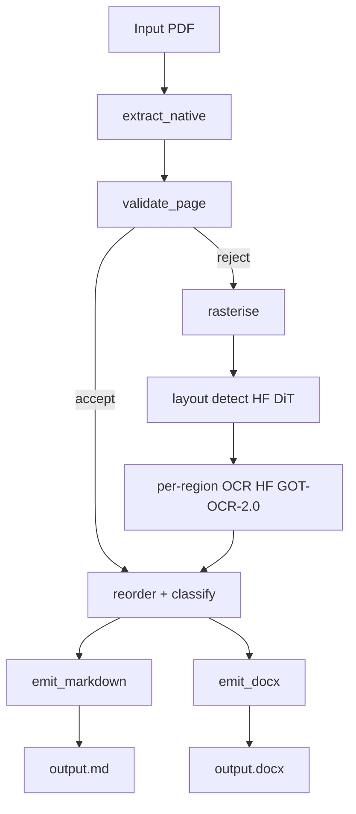

# arabic-pdf-transcribe

Arabic-first PDF transcriber. Native text extraction first; layout detection +
OCR fallback when the text layer is missing or broken. RTL-aware reading order.
Emits Markdown and Word.

**Status:** v0.1.0 — all nine SPIR phases shipped. The release is feature-complete
against the spec; the in-tree benchmark corpus is reproducibility-focused
(synthetic fixtures generated by `tools/generate_fixtures.py`). A real
Arabic-text benchmark corpus, ML-path CER reference texts, and the
threshold-tuning carry-over from phase 3 are tracked as post-v1
follow-ups in [`CHANGELOG.md`](CHANGELOG.md).

## Install

```bash
python -m venv .venv && source .venv/bin/activate
pip install -e ".[dev]"          # native path only (deterministic, no ML)
pip install -e ".[ml,dev]"       # full pipeline with HF layout + OCR
```

The `ml` extra pulls in `transformers`, `torch`, `torchvision`, `Pillow`, and
`huggingface-hub`. None of these are required for the deterministic
native-extraction path; the CLI falls back to "no ML" mode when the extra is
not installed and surfaces a typed error if a page actually needs the ML branch.

### CPU-only install (no NVIDIA / CUDA)

The default PyPI wheels for `torch` / `torchvision` ship the NVIDIA CUDA
runtime. If you do not have (or do not want) a GPU, install the CPU-only
wheels first so pip pulls them from the PyTorch wheel index instead of the
CUDA bundle:

```bash
pip install torch==2.5.1+cpu torchvision==0.20.1+cpu \
    --index-url https://download.pytorch.org/whl/cpu
pip install -e ".[ml,dev]"
```

`torchvision==0.20.1` is the release built against `torch==2.5.1`; mismatched
versions surface as ``operator torchvision::nms does not exist`` when the
layout model's image processor loads.

## CLI usage

```bash
arabic-pdf-transcribe FILE                                # stdout, Markdown
arabic-pdf-transcribe FILE -o out.md                      # Markdown to file
arabic-pdf-transcribe FILE -o out.docx                    # Word to file
arabic-pdf-transcribe FILE --pages 1-3,7,10-12 -o out.md  # page filter
arabic-pdf-transcribe FILE --strict                       # abort on first failure
arabic-pdf-transcribe FILE --json-logs                    # structured stderr
arabic-pdf-transcribe FILE --debug-json sidecar.json      # per-region confidences
arabic-pdf-transcribe FILE --config tunings.toml          # validator/layout/ocr/render
```

### Exit codes

| Code | Meaning |
|------|---------|
| `0` | success (or partial-success in default best-effort mode) |
| `2` | `--strict` abort, or all pages failed in best-effort mode |
| `3` | encrypted / password-protected PDF |
| `4` | corrupted PDF, or `--format` ↔ output extension disagreement |
| `5` | ML model missing (cache miss while offline) |

### Config file (TOML)

```toml
[validator]
min_arabic_ratio = 0.5
max_replacement_ratio = 0.05
max_word_boundary_kl = 1.0

[layout]
pixel_confidence = 0.5
min_region_area_px = 64

[ocr]
max_new_tokens = 4096
num_beams = 1

[render]
dpi = 200
```

The CLI's `--dpi` flag wins over `[render].dpi` when both are given.

## Library usage

```python
from arabic_pdf_transcribe.pipeline import transcribe
from arabic_pdf_transcribe.emit.markdown import emit_markdown

result = transcribe("input.pdf")
print(emit_markdown(result.regions))
```

Every pipeline stage is a swappable Protocol — inject custom validators,
layout detectors, OCR transcribers, or emitters via the `transcribe(...)` kwargs.
See [`docs/architecture.md`](docs/architecture.md) for the full module map.

## Architecture



- **Native path** (no ML model load): clean digital Arabic PDFs.
- **ML path**: layout detection (DiT-base) → per-region OCR (GOT-OCR-2.0) on rasterised pages.
- **Validator** decides per page; mixed PDFs work in one document.

## Models (default pipeline)

| Stage | Model | Revision (pinned) | License | ~Size |
|---|---|---|---|---|
| Layout | `cmarkea/dit-base-layout-detection` | `1995237326c8b53d93525b7b19e20bb363b4eb73` | Apache-2.0 | ~330 MB |
| OCR | `stepfun-ai/GOT-OCR-2.0-hf` | `d3017ef2c2c1395888c8d635c5e0508bcb0ac78d` | Apache-2.0 | ~1.1 GB |

See [`docs/model-card.md`](docs/model-card.md) for the full per-model card,
including selection rationale (the DiT model was chosen over DocLayout-YOLO and
Surya because the latter two have non-permissive licenses that fail this
project's license audit).

## Local checks

```bash
make lint     # ruff check + format check
make test     # pytest with coverage
make audit    # license audit (runtime deps + models.toml)
make all      # all of the above
```

## Reproducibility

- **Native path**: byte-identical Markdown output across runs with pinned
  `pypdfium2` and `python-docx` versions.
- **ML path**: reproducible up to model floating-point determinism (CPU);
  E2E tests use Character Error Rate (CER) ≤ 0.05 against `*.expected.md`
  reference files.

## Security

- PDF parsing via `pypdfium2` with no JavaScript execution and no external
  resource resolution (the loader pins these defaults explicitly).
- Markdown / Word emitters escape adversarial text (leading list markers,
  pipes inside table cells, raw HTML, embedded macros).
- All model weights pinned by revision hash, not floating tag.
- No telemetry; no automatic phone-home; the pipeline runs offline once
  models are cached.

## Determinism caveats

- Word output's `core.xml` carries timestamps from `python-docx`, but
  `word/document.xml` (the body) is byte-identical across runs and is the
  surface tested for determinism.
- Arabic visual rendering depends on the consumer's bidi engine. The emitter
  output is logical-order Unicode plus a leading U+200F when the paragraph
  is Arabic-dominant and contains LTR runs.

## License

MIT — see [LICENSE](LICENSE).
