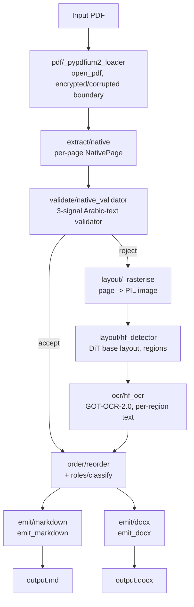

# Architecture

`arabic-pdf-transcribe` is a CLI + library that turns Arabic PDFs into Markdown
or Word output. The pipeline is **native-first**: it reads the PDF's text layer
and runs a quality validator; only when the text layer is missing or judged
unreliable does it fall back to a layout-detection + OCR ML branch.

This document covers the module-by-module layout, the cross-stage data
contract (the `Region` schema), and how the pieces compose into the
orchestrator.

## Pipeline overview

The orchestrator (`pipeline.transcribe`) holds a single `pypdfium2`
document handle for the whole run and dispatches per page through the
`PageOutcome` channel — native, ML, or failed.

## Modules

| Module | Phase | Owns |
|---|---|---|
| `regions.py` | 2 | `Region`, `BBox`, `RegionRole`, `RegionSource`, `ListMarker`, `TableCell`, `TableGrid`. The unified document model that every other module produces or consumes. |
| `errors.py` | 1, 2, 8 | Typed exception hierarchy mapped to CLI exit codes. |
| `pdf/_pypdfium2_loader.py` | 2 | Safe-by-default `pypdfium2` wrapper; translates encrypted/corrupted PDFs to typed errors at the boundary. |
| `extract/native.py` | 2 | Text-layer extraction. Yields `NativePage` per page (paragraphs + font-size histogram + `has_text_layer`). Accepts a `pages` filter so non-selected pages do zero work. |
| `extract/_native_tables.py` | 2 | Detects native tables from line geometry. |
| `validate/native_validator.py` | 3 | Three signals — Arabic-codepoint ratio, replacement-glyph ratio, word-boundary KL divergence — gate the native path. Any signal flagging a page → ML branch. |
| `validate/_reference_dist.json` | 3 | Reference Arabic word-length distribution (KL denominator). |
| `layout/__init__.py` | 4 | `LayoutDetector` Protocol — integration boundary. |
| `layout/hf_detector.py` | 4 | DiT-base layout detector (HuggingFace). Connected components on per-pixel class map → `Region` bboxes. Lazy `transformers` / `torch` imports. |
| `layout/_classes.py` | 4 | Mapping from DiT class labels to `RegionRole`. |
| `layout/_rasterise.py` | 4 | Page rasterisation via `pypdfium2.PdfPage.render`. Default DPI 200; configurable via `--dpi` or `[render].dpi`. |
| `layout/_table_cells.py` | 4 | Table-cell grid detection on rasterised page crops. |
| `ocr/__init__.py` | 5 | `OCRTranscriber` Protocol. |
| `ocr/hf_ocr.py` | 5 | GOT-OCR-2.0 adapter; per-region transcription on the cropped bbox. Lazy imports. |
| `ocr/_crop.py` | 5 | Padded crop helper. |
| `order/reorder.py` | 6 | RTL-aware reading-order reconstruction (column detection → row banding → within-band right-to-left). |
| `roles/classify.py` | 6 | Heading-level inference, list-marker detection, header/footer pruning, caption-figure linkage. |
| `emit/markdown.py` | 7 | GFM-compatible Markdown; escape-safe; consecutive list items share a block; pipe-tables; figure-caption pairing; HTML-comment failure placeholders. |
| `emit/docx.py` | 7 | python-docx with built-in styles; lazy `python-docx` import (the package import doesn't pull `docx`). |
| `emit/_normalise.py` | 7 | NFC default (preserves Arabic presentation forms); NFKC opt-in. |
| `emit/_md_escape.py` | 7 | Inline + leading-block + table-cell escaping. |
| `emit/_bidi.py` | 7 | U+200F RLM injection for Arabic-dominant paragraphs containing LTR runs. |
| `pipeline.py` | 8 | Orchestrator. Single document handle; per-page native vs ML branch dispatch; failure-region synthesis; CUDA OOM detection without `torch` import. |
| `_logging.py` | 8 | Progress logger (text / quiet / JSON). No timestamps in JSON mode → byte-stable stderr. |
| `cli.py` | 8 | argparse + `validate_args` (resolves format/extension conflicts up-front) + exit-code mapping. |

## Data contract — `Region`

The schema is versioned (`REGION_SCHEMA_VERSION = "1"`) and serialisable to
JSON for the `--debug-json` sidecar. Every stage produces or consumes
`Region`s; no module sees raw `pypdfium2`/`transformers` types past the
adapter boundary.

Key fields:

- `page_index: int`, `bbox: BBox`, `text: str`
- `role: RegionRole` — `HEADING | PARAGRAPH | LIST_ITEM | TABLE | FIGURE | CAPTION | HEADER_FOOTER | FAILURE_PLACEHOLDER | UNKNOWN`
- `source: RegionSource` — `NATIVE | OCR`
- `confidence: float | None`, `heading_level: int | None`,
  `list_marker: ListMarker | None`, `table_grid: TableGrid | None`,
  `group_id: str | None`, `failure_reason: str | None`
- `meta: Mapping[str, Any]` — frozen tuple internally so the Region is hashable;
  carries flags like `v1_table_simplification`.

## Failure semantics

- **Encrypted PDF** → `EncryptedPDFError` → exit 3.
- **Corrupted PDF / format-extension mismatch** → exit 4.
- **ML model missing** → `ModelDownloadError` → exit 5.
- **Per-page failures** in default mode synthesise a `FAILURE_PLACEHOLDER`
  region (with `RegionSource` reflecting which branch failed) and the
  pipeline continues. With `--strict`, the original exception re-raises.
- **CUDA OOM** is detected by class metadata (`__module__ == "torch"`,
  `__name__ == "OutOfMemoryError"`) without importing `torch`.

## Determinism

- Native path: byte-identical Markdown.
- ML path: CER ≤ 0.05 against reference (CPU; GPU floating-point determinism
  is not guaranteed by the spec).
- `python-docx` writes timestamps to `core.xml`; `word/document.xml` (the body)
  is byte-identical across runs and is the determinism contract.

## Lazy-import discipline

- `import arabic_pdf_transcribe` does not pull `transformers`, `torch`,
  `huggingface_hub`, `PIL`, or `python-docx` into `sys.modules`. Each is
  imported lazily inside the function that needs it. Tests assert this in
  subprocess-isolated runs (`tests/test_skeleton.py`,
  `tests/test_layout_lazy_import.py`, `tests/test_ocr_lazy_import.py`,
  `tests/test_emit_lazy_import.py`).
